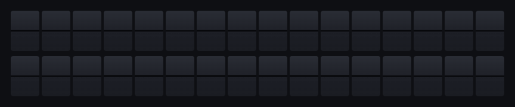

# Split-Flap Sign

An animated split-flap (Solari) display in your browser. Type a message and
each tile cycles through the alphabet until it lands on the right letter.



- **Configurable layout** — defaults to 2 rows × 16 columns; change live
  with the rows/columns fields under the sign.
- Vertical placement is automatic:
  - Lines fill from the top row downward
  - Each line is horizontally centered
- Word-aware wrapping — words are never split across lines (unless a single
  word is longer than `cols`, in which case it's hard-wrapped)
- Allowed characters: `A–Z 0–9 . , ! ? - : / & '` (lowercase is uppercased,
  unsupported characters become spaces)
- **Export the animation as an animated GIF** with the "Export GIF" button.

## Customizing the sign size

Use the **Layout** controls beneath the sign to set rows (1–12) and
columns (1–40), then click **Apply**. The sign rebuilds in place, the
input field's max length (`rows × cols + (rows − 1)`) updates, and the
GIF export uses the new dimensions immediately. Your choice is saved to
`localStorage`, so reloading the page brings it back.

The Slack bot has its own dimensions in `config.json` at the repo root —
see `slack-bot/README.md`.

## Run

No build step required — it's a static page. The GIF export uses Web Workers,
so the page must be served over HTTP (not opened from disk).

```sh
# from the project directory
python3 -m http.server 8000
# then open http://127.0.0.1:8000
```

## Files

- `config.json` — sign dimensions (rows, cols) used by the **Slack bot only**
- `index.html` — page structure
- `styles.css` — split-flap visuals + flip animation keyframes
- `app.js` — tile/sign classes, text wrapping, live DOM animation loop,
  layout controls
- `record.js` — offscreen canvas renderer + GIF encoder
- `vendor/gif.js`, `vendor/gif.worker.js` — GIF89a encoder
  ([gif.js](https://github.com/jnordberg/gif.js) by Johan Nordberg, MIT)
- `slack-bot/` — Slack slash-command integration (see its own README)

## How the animation works

Each tile owns two static halves (top and bottom of the *current* character)
plus two transient "flaps" that appear during a flip:

1. The **top flap** shows the *old* upper half and rotates around its bottom
   edge (`rotateX 0 → -90°`), revealing the new upper half on the static
   surface beneath it.
2. The **bottom flap** shows the *new* lower half and rotates around its top
   edge (`rotateX 90° → 0°`), settling into place over the static lower half
   (which is updated to the new character at the midpoint, while the flap
   still hides it).

A single character change is one such flip (~70 ms). To go from blank to a
target letter, the tile chains flips through the alphabet sequence one step
at a time, so tiles whose targets are deeper into the sequence finish later
— giving a satisfying cascading-stop effect.

## How the GIF export works

`record.js` doesn't try to screen-capture the live DOM. It re-derives the
animation deterministically:

1. Compute each tile's target index from the message.
2. For each tile, the state at time `t` is just `floor(t / 70 ms)` — which
   step of the alphabet it's currently flipping through, plus a 0–1
   progress for the flap rotation.
3. Render each frame onto an offscreen canvas at 25 fps. The flap
   foreshortening is `cos(angle)`, matching the perspective transform that
   the live CSS uses.
4. Hand frames to `gif.js` workers, which encode a GIF89a blob.
5. Trigger a download.

The canvas dimensions are derived from the current rows/columns set via
the page's Layout controls (at default 2×16, the GIF is 864×180). The
GIF always renders at the same absolute size regardless of how the live
sign is scaled in the viewport.
